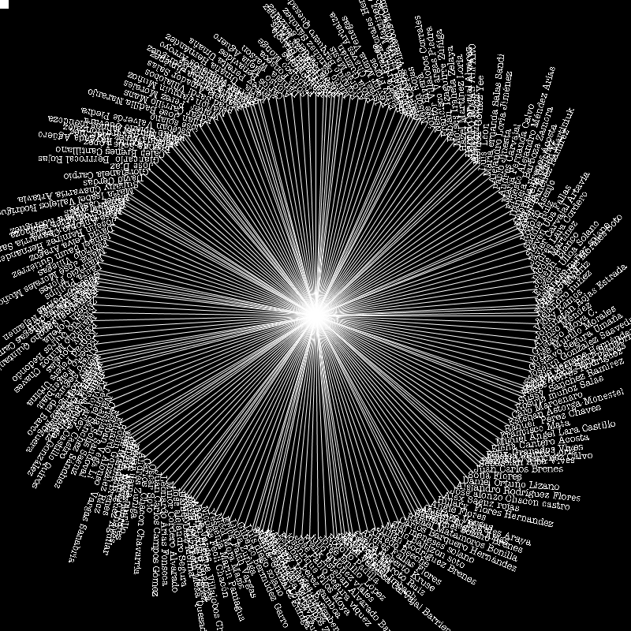
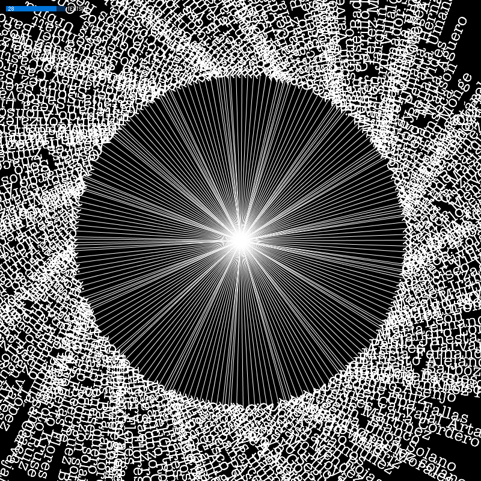
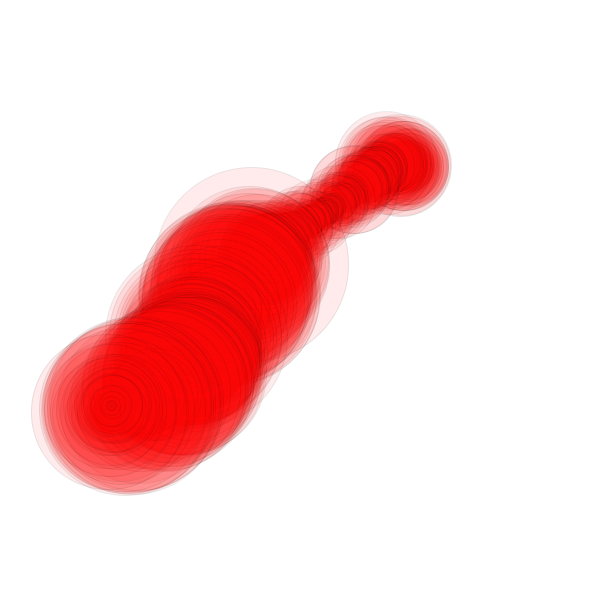
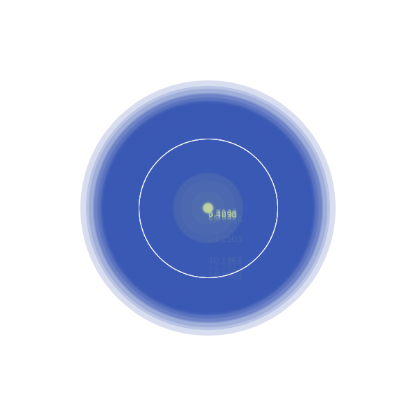

# Datos

En estas sección se cubren:

1. Cargad de archivo de datos
2. Uso de librería ControlP5

##Cargar datos

##Librería ControlP5

Pueden encontrar más detalles de la librería en este [link](http://www.sojamo.de/libraries/controlP5/), sin embargo, explorara los ejemplos que vienen con la librería para ver su uso.

##Leyendo datos con buffer

A veces son muchos datos y es mejor irlos leyendo línea por línea. Para eso se puede utilizar el objeto [BufferedReader](https://processing.org/reference/BufferedReader.html)
